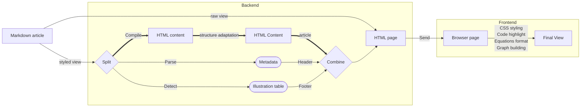

# Blogd

> Writing an article is easy, presenting it correctly is not.

The goal behind this project is to quickly write (well presented) articles and expose them to the Internet.

The site is live at [this url](www.dodax.site).
An explanation of how does this blog works is available [here](https://www.dodax.site/articles/how-this-blog-works). The source of this article is avaible under [articles/how-this-blog-works](./articles/how-this-blog-works.md)

#### Detailed Workflow

* * *

2023 &copy; Dorian Beauchesne
