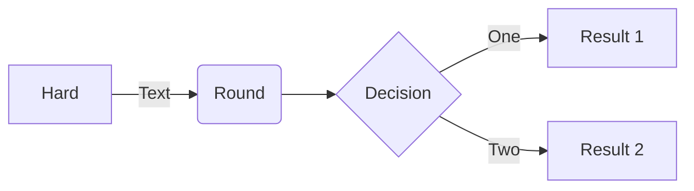

# How does this blog works ?
> Writing an article is easy, presenting it correctly is not.

The goal behind this website is to quickly write (well presented) articles and expose them to the Internet.
To do so, articles are simply written ina single *Markdown* file (to view the source, juste add `.md` to the end of any article name in the url). 
*Markdown* (`md`) is a very common **markup language** along the developpers. For instance, most of [GitHub](https://github.com) (an open-source "code sharing" plateform) `README` file are written in Markdown.  

> A markup language is : "a standard text-encoding system consisting of a set of symbols inserted in a text document to control its structure, formatting, or the relationship between its parts."[^1]

There is multiple markup languages, the most known are : 
 - **HTML** : The language of the web. Every website is written in HTML.
    ```html 
    <h1>This is a Heading</h1>
    <p>
        This is a paragraph with a link to <a href="https://www.mozilla.org/fr/">Mozilla</a>.
    </p>
    ```

 - **LaTeX** : used for writing scientific papers, especially usefull for equations
    ```latex
    \begin{equation} \label{eq:erl}
    a = bq + r
    \end{equation}

    where \eqref{eq:erl} is true if $a$ and $b$ are integers with $b \neq c$
    ```
    Which translate to : 
    
    

- **Markdown** : straight forward formating language
    ```md
    # How does this blog works ?
    > Writing an article is easy, presenting it correctly is not.

    *Markdown* (`md`) is a very common **markup language** along the developpers : most of [GitHub](https://github.com) `README` file are written in Markdown.
    ```

> So why choosing *Markdown* for this blog ?  

*Markdown* has sevaral advantages compared to other markup language, or even plain text. 
First of all, it's a **simple language** to learn. The basics of the syntax consists in a [simple cheatsheet](https://github.com/adam-p/markdown-here/wiki/Markdown-Cheatsheet) that can be find everywhere on Internet.   
Moreover, *Markdown* it has the advantage of beeing pretty **straight forward** : it's easier to be focus on the content when there is no need to care about the styling.  
With a technical point of view, *Markdown* is simple to parse and thought to automaticaly style, which ensure a **visual coherence** between articles on the blog. This also can be an issue : when it comes to formatting *Markdown* doesn't provide as much freedom as HTML/CSS (even if HTML can be use in *Mardown* files - for safety reasons, HTML content in these blog articles won't be parsed). 

So let's take a quick look of how the *Markdown* syntax works.

## The Markdown syntax 
A very good tool to write *Markdown* is [this](https://github.com/adam-p/markdown-here/wiki/Markdown-Cheatsheet) page. It reference most of the *Markdown* specificities.  

For a quick example, here is the source of the top paragraph : 
```md
## The Markdown syntax 
A very good tool to write *Markdown* is [this](https://github.com/adam-p/markdown-here/wiki/Markdown-Cheatsheet) page. It reference most of the *Markdown* specificities.  
```

### Editor Setup
I use a code editors to write *Markdown* (**Visual Studio Code**), which allows me to have syntax highligting and a live preview of the article. But some other tools exists, for example [this online app](https://stackedit.io/app).

## This blog specificities
This articles written in *Markdown* can't be displayed in a web browser, because they only take *HTML* files as input.

### Metadata



[^1]: https://www.britannica.com/technology/markup-language